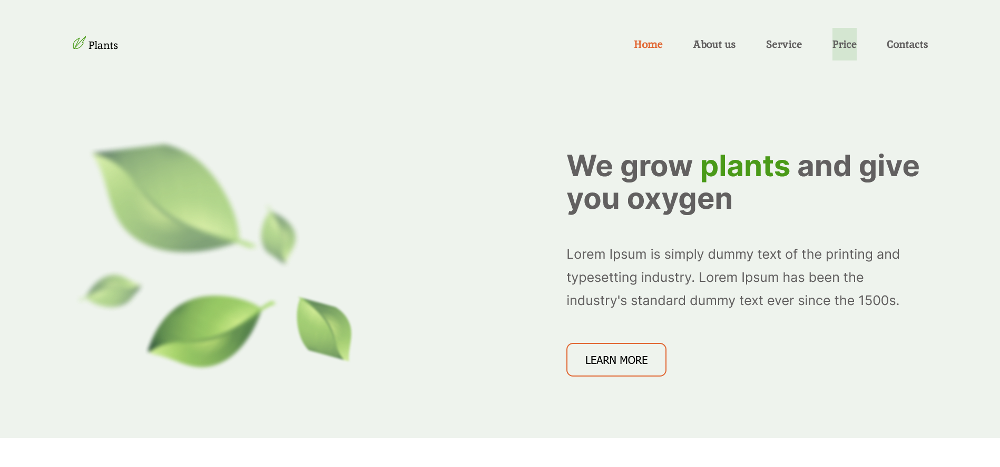
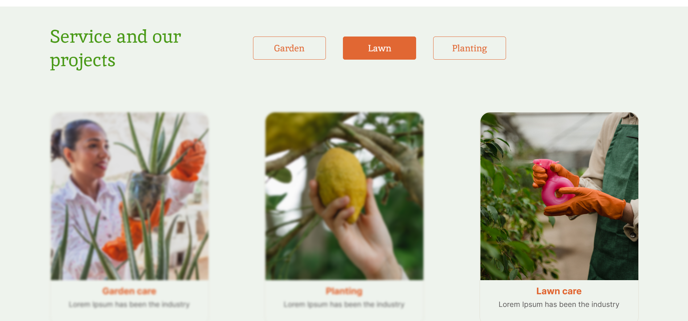
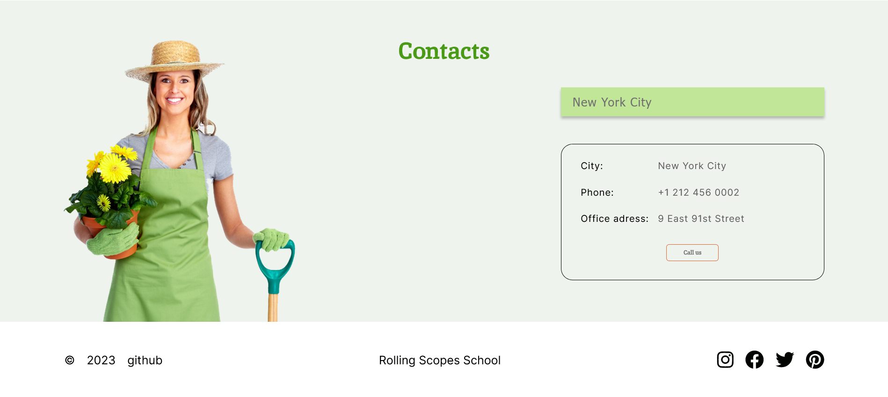

# [Plants Landing page](https://eugenezanevskij.github.io/plants/plants/)

Plants – задание stage#0 в ходе выполнения которого вы сверстаете landing page сайта, который предлагает свои услуги по выращиванию растений в саду и ухода за ними, сделаете его адаптивным и интерактивным.

## Key skills:
- valid semantic adaptive layout
- easily maintainable readable code
- exporting styles and graphics from Figma
- using JavaScript to implement the functionality specified in the task

## Table of contents

- [Overview](#overview)
  - [The challenge](#the-challenge)
  - [Screenshot](#screenshot)
  - [Links](#links)
- [My process](#my-process)
  - [Built with](#built-with)
  - [What I learned](#what-i-learned)
  - [Continued development](#continued-development)
  - [Useful resources](#useful-resources)
- [Author](#author)

## Overview

### The challenge

- View the optimal layout depending on their device's screen size
- See hover and focus states for interactive elements
- See responsive navbar
- Change of focus on services in section "Service and our projects"
- Accordion in section prices 
- Select in section "Contacts"

### Screenshot

Desktop version



- In section "Service and our projects" there's a change of focus on services




### Links

- Solution URL: [Plants GitHub](https://github.com/EugeneZanevskij/plants)
- Live Site URL: [Plants Landing page Live version](https://eugenezanevskij.github.io/plants/plants/)

## My process

### Built with

- Semantic HTML5 markup
- CSS custom properties
- Flexbox
- Mobile-first workflow
- BEM
- SCSS
- npm sass
- Figma
- JS
- DOM API

### What I learned

This was the project I found thanks to RS Schools. It focused on 100% accuracy of layout. I worked on it step by step, making media-queries simultaneously.
the biggest problem I solved was how to build Service's section focus:

```js
serviceBtns.forEach((serviceBtn) => {
  serviceBtn.addEventListener("click", (e) => {
    const type = e.target.dataset.type;
    //to deactivate buttons
    serviceBtns.forEach((serviceBtnItem) => {
      if (serviceBtnItem !== e.target) {
        serviceBtnItem.classList.remove("active");
      }
    });
    //to make button active
    e.target.classList.toggle("active");
    //transform to array to check num of ACTIVE btns
    const serviceBtnsArr = Array.from(serviceBtns);
    const numActive = serviceBtnsArr.filter((item) =>
      item.classList.contains("active")
    ).length;
    //to check which projects have other type
    serviceProjects.forEach((serviceProject) => {
      serviceProject.classList.remove("blur");
      if (numActive === 0) {
        return;
      } else if (serviceProject.dataset.type !== type) {
        serviceProject.classList.add("blur");
      }
    });
  });
});
```

```css
.card.blur {
  -webkit-filter: blur(0.125rem);
  -moz-filter: blur(0.125rem);
  -ms-filter: blur(0.125rem);
  -o-filter: blur(0.125rem);
  filter: blur(0.125rem);
}
```

Working on this project I also worked with `npm sass`.

When using `sass` in order to build this solution:

- Install `sass`:

```bash
npm install -g sass
```

- Run build command from command line:

```bash
sass src/sass/main.scss src/css/main.css
```

- If you want to edit the code and test:

```bash
sass --watch src/sass/main.scss src/css/main.css
```

### Continued development

In future projects I want to focus more on using JS in my work, learn how to start working on project faster using SASS.

### Useful resources

- [Sass Guidelines](https://sass-guidelin.es/) - An opinionated styleguide for writing sane, maintainable and scalable Sass.
- [Sass Basics](https://sass-lang.com/guide) - Basics on how to transform SCSS into CSS using terminal.
- [BEM](https://css-tricks.com/bem-101/) - Basics of BEM methodology.

## Author

- LinkedIn - [Eugene Zanevskij](https://www.linkedin.com/in/eugene-zanevskij/)
- GitHub - [@EugeneZanevskij](https://github.com/EugeneZanevskij)